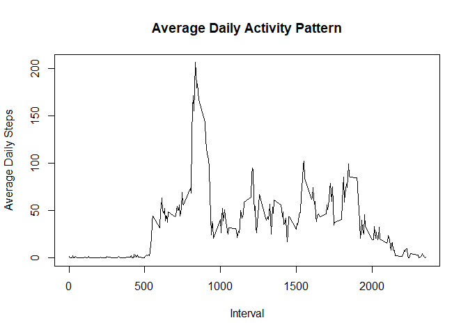

## Synopsis
This report makes use of data from a personal activity monitoring device which collects data at 5 minute intervals throughout the day. The data consists of two months of data from an anonymous individual collected during the months of October and November, 2012 and include the number of steps taken in 5 minute intervals each day.

The dataset can be downloaded from [Activity monitoring data](https://d396qusza40orc.cloudfront.net/repdata%2Fdata%2Factivity.zip) [52K].

The dataset is stored in a comma-separated-value (CSV) file and there are a total of 17,568 observations in this dataset. The variables included in this dataset are:

- **steps:** Number of steps taken in a 5-minute interval (missing values are coded as <span style="color: red;">NA</span>)
- **date:** The date on which the measurement was taken in YYYY-MM-DD format
- **interval:** Identifier for the 5-minute interval in which measurement was taken


## Loading and preprocessing the data
The dataset is loaded to the **data** dataframe using *read.csv* to access the unzipped ***activity.csv*** file. 

```r
data <- read.csv((unz("activity.zip", "activity.csv")))
head(data)
```

```
##   steps       date interval
## 1    NA 2012-10-01        0
## 2    NA 2012-10-01        5
## 3    NA 2012-10-01       10
## 4    NA 2012-10-01       15
## 5    NA 2012-10-01       20
## 6    NA 2012-10-01       25
```

```r
summary(data)
```

```
##      steps            date              interval     
##  Min.   :  0.00   Length:17568       Min.   :   0.0  
##  1st Qu.:  0.00   Class :character   1st Qu.: 588.8  
##  Median :  0.00   Mode  :character   Median :1177.5  
##  Mean   : 37.38                      Mean   :1177.5  
##  3rd Qu.: 12.00                      3rd Qu.:1766.2  
##  Max.   :806.00                      Max.   :2355.0  
##  NA's   :2304
```
A subset of the data with the missing values (<span style="color: red;">NA</span>) removed is saved to the **data_complete** dataframe. It could be seen from the *summary* that the missing values record had been removed and the number of observations had been reduced from 17,568 to 15,264.

```r
data_complete <- data[complete.cases(data),]
head(data_complete)
```

```
##     steps       date interval
## 289     0 2012-10-02        0
## 290     0 2012-10-02        5
## 291     0 2012-10-02       10
## 292     0 2012-10-02       15
## 293     0 2012-10-02       20
## 294     0 2012-10-02       25
```

```r
summary(data_complete)
```

```
##      steps            date              interval     
##  Min.   :  0.00   Length:15264       Min.   :   0.0  
##  1st Qu.:  0.00   Class :character   1st Qu.: 588.8  
##  Median :  0.00   Mode  :character   Median :1177.5  
##  Mean   : 37.38                      Mean   :1177.5  
##  3rd Qu.: 12.00                      3rd Qu.:1766.2  
##  Max.   :806.00                      Max.   :2355.0
```
## What is mean total number of steps taken per day?
Ignoring the missing values in the dataset, calculate the number of steps taken per day

```r
daily_steps <- tapply(data_complete$steps, data_complete$date, FUN=sum)
daily_steps
```

```
## 2012-10-02 2012-10-03 2012-10-04 2012-10-05 2012-10-06 2012-10-07 2012-10-09 
##        126      11352      12116      13294      15420      11015      12811 
## 2012-10-10 2012-10-11 2012-10-12 2012-10-13 2012-10-14 2012-10-15 2012-10-16 
##       9900      10304      17382      12426      15098      10139      15084 
## 2012-10-17 2012-10-18 2012-10-19 2012-10-20 2012-10-21 2012-10-22 2012-10-23 
##      13452      10056      11829      10395       8821      13460       8918 
## 2012-10-24 2012-10-25 2012-10-26 2012-10-27 2012-10-28 2012-10-29 2012-10-30 
##       8355       2492       6778      10119      11458       5018       9819 
## 2012-10-31 2012-11-02 2012-11-03 2012-11-05 2012-11-06 2012-11-07 2012-11-08 
##      15414      10600      10571      10439       8334      12883       3219 
## 2012-11-11 2012-11-12 2012-11-13 2012-11-15 2012-11-16 2012-11-17 2012-11-18 
##      12608      10765       7336         41       5441      14339      15110 
## 2012-11-19 2012-11-20 2012-11-21 2012-11-22 2012-11-23 2012-11-24 2012-11-25 
##       8841       4472      12787      20427      21194      14478      11834 
## 2012-11-26 2012-11-27 2012-11-28 2012-11-29 
##      11162      13646      10183       7047
```
Plot a histogram of the total number of steps taken each day

```r
hist(daily_steps, breaks = 20, col = "violet", xlim = c(0, 25000), main = "Total Number of Steps Taken Each Day", xlab = "Steps")
```

<!-- -->

Calculate and report the mean and median of the total number of steps taken per day.

```r
mean(daily_steps)
```

```
## [1] 10766.19
```

```r
median(daily_steps)
```

```
## [1] 10765
```
## What is the average daily activity pattern?
The average daily steps taken for each interval is computed by taking the mean value of the steps taken for each of the interval across all days.

A time series of the 5-minute interval (x-axis) and the average number of steps taken, averaged across all days (y-axis) can be used to show the average daily activity pattern. 

```r
library(dplyr)

interval_steps <- data_complete %>% group_by(interval) %>% summarise(steps = mean(steps), .groups = "keep")

plot(interval_steps$interval, interval_steps$steps, type ='l', main = "Average Daily Activity Pattern", xlab="Interval", ylab="Average Daily Steps")
```

<!-- -->

Which 5-minute interval, on average across all the days in the dataset, contains the maximum number of steps?

```r
interval_steps[which.max(interval_steps$steps),]$interval
```

```
## [1] 835
```
## Imputing missing values
The original dataset, loaded to the **data** dataframe contains missing values (coded as <span style="color: red;">NA</span>). The presence of missing days may introduce bias into some calculations or summaries of the data.

Calculate and report the total number of missing values in the dataset (i.e. the total number of rows with <span style="color: red;">NA</span>s)

```r
sum(is.na(data))
```

```
## [1] 2304
```
Devise a strategy for filling in all of the missing values in the dataset. 

If the missing values were to be filled in with 0, then the mean and median total number of steps taken per day will be:

```r
data_filled_0 <- data %>% mutate(steps = ifelse(is.na(steps), 0, steps))
daily_0_filled_steps <- tapply(data_filled_0$steps, data_filled_0$date, FUN=sum)

mean(daily_0_filled_steps)
```

```
## [1] 9354.23
```

```r
median(daily_0_filled_steps)
```

```
## [1] 10395
```
Another strategy is to use the mean of the corresponding 5-minute interval to fill in all of the missing values. This strategy will produce a different mean and median values from imputing with zeros. 

To create a new dataset that is equal to the original dataset but with the missing data filled in with the mean of the 5-minute interval, the values from the **interval_steps** (containing the mean values of each 5-minute interval across all days) can be merge to the original **data** to replace any missing value with the rounded-up mean value of that particular 5-minute interval. 

```r
data_imputed <- left_join(data, interval_steps, by = "interval") %>% mutate(steps = ifelse(is.na(steps.x), round(steps.y), steps.x)) %>% select(-steps.x, -steps.y)

head(data_imputed)
```

```
##         date interval steps
## 1 2012-10-01        0     2
## 2 2012-10-01        5     0
## 3 2012-10-01       10     0
## 4 2012-10-01       15     0
## 5 2012-10-01       20     0
## 6 2012-10-01       25     2
```
Make a histogram of the total number of steps taken each day 

```r
daily_imputed_steps <- tapply(data_imputed$steps, data_imputed$date, FUN=sum)

hist(daily_imputed_steps, breaks = 20, col = "orange", xlim = c(0, 25000), ylim = c(0, 20), main = "Total Number of Steps Taken Each Day with Missing Data filled", xlab = "Steps")
```

<!-- -->

Calculate and report the **mean** and **median** total number of steps taken per day. Do these values differ from the estimates from the first part of the assignment? What is the impact of imputing missing data on the estimates of the total daily number of steps?

```r
mean(daily_imputed_steps)
```

```
## [1] 10765.64
```

```r
median(daily_imputed_steps)
```

```
## [1] 10762
```
Yes, the **mean** and **median** values of the imputed missing data is slightly lesser than the estimates of the first part of the assignmnt and the histogram shows that some of intervals has higher frequency when the missing data were imputed with the interval mean value.

| Dataset | Mean | Median |
| ----------- | ----------- | ----------- |
| Original dataset with NAs | 10766.19 | 10765 |
| Dataset imputed with zero (0) | 9354.23 | 10395 |
| Dataset imputed with 5-minute interval mean | 10765.64 | 10762 |

## Are there differences in activity patterns between weekdays and weekends?
Create a new factor variable in the dataset with two levels – “weekday” and “weekend” indicating whether a given date is a weekday or weekend day. First change the date in the dataset from chr type to date type, then use the weekdays function to determine if it is a weekend or weekday day. Then change the new factor variable **day_type** from chr to factor data type.

```r
data_imputed$date <- as.Date(data_imputed$date, "%Y-%m-%d")
data_imputed$day_type <- ifelse(weekdays(data_imputed$date) %in% c("Saturday", "Sunday"), "weekend", "weekday")

data_imputed$day_type <- as.factor(data_imputed$day_type)

head(data_imputed)
```

```
##         date interval steps day_type
## 1 2012-10-01        0     2  weekday
## 2 2012-10-01        5     0  weekday
## 3 2012-10-01       10     0  weekday
## 4 2012-10-01       15     0  weekday
## 5 2012-10-01       20     0  weekday
## 6 2012-10-01       25     2  weekday
```

Make a panel plot containing a time series plot (i.e. <span style="color: red;">type = "l"</span>) of the 5-minute interval (x-axis) and the average number of steps taken, averaged across all weekday days or weekend days (y-axis). 

```r
library(dplyr)
library(ggplot2)

interval_steps_imputed <- data_imputed %>% group_by(day_type, interval) %>% summarise(steps = mean(steps), .groups="keep")

ggplot(interval_steps_imputed , aes(x = interval , y = steps, color=day_type)) + geom_line() + theme(legend.position = "None") + labs(title = "Average Daily Steps across all Weekday or Weekend Days", x = "Interval", y = "Number of Steps") + facet_wrap(~day_type , ncol = 1, nrow=2)
```

<!-- -->
